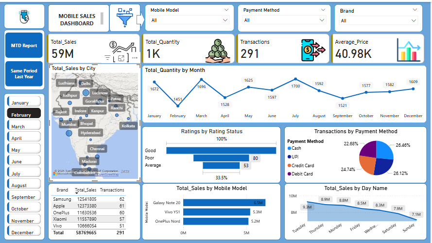

# Mobile Sales Dashboard – Power BI Project

This project demonstrates a sales dashboard built using Power BI to analyze mobile phone sales data. It provides insights into key performance indicators such as total revenue, month-to-date sales, and year-over-year comparisons.

## Project Files

- Mobile_Sales_Dashboard.pbix – Power BI report file
- Dashboard.png – Overview of the full dashboard
- MTD_Report.png – Month-to-Date performance view
- Same_Period_Last_Year.png – Year-over-Year comparison

## Key Features

- Interactive dashboard with slicers
- Month-to-Date and Year-over-Year metrics
- Brand and product-level sales analysis
- Regional performance (using map visuals)
- Clean and responsive layout for reporting

## Tools Used

- Power BI Desktop
- DAX (for calculated measures)
- Data Modeling and Relationships
- Power BI Visualizations and Filters

## 📸 Dashboard Previews

### 🔹 Full Dashboard

### 🔹 Month-to-Date Report

### 🔹 Same Period Last Year

## Learning Highlights
- Designed a user-friendly sales dashboard for business reporting
- Applied DAX to create time-based calculations
- Used visuals to simplify complex data insights

## About

Created by Ayushi Singh as part of a data analytics portfolio. This project showcases data visualization and reporting skills using Power BI.

